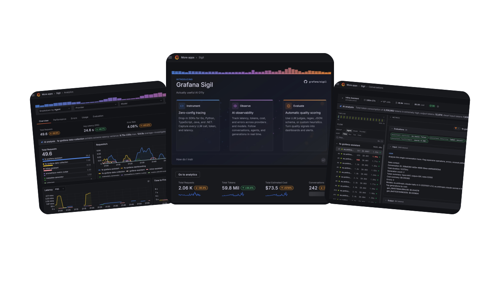

# Grafana Agent Observability SDK

<p align="center">
  
</p>

[Grafana Agent observability](https://grafana.com/docs/grafana-cloud/machine-learning/agent-observability/) is a product from Grafana for teams running agents in production. This repo holds the open-source SDKs and the coding-agent plugins that send telemetry to it.

## Quick start (with an AI coding agent)

If you want your own app or agent code instrumented, the recommended path is the `agento11y-instrument` agent skill. [`gcx`](https://github.com/grafana/gcx) is Grafana's CLI for working with Grafana Cloud resources; see the [`gcx` installation docs](https://github.com/grafana/gcx#installation) if you want more detail.

Install `gcx` with the quick install script:

```sh
curl -fsSL https://raw.githubusercontent.com/grafana/gcx/main/scripts/install.sh | sh
```

Or with Homebrew:

```sh
brew install grafana/grafana/gcx
```

Then install the skill:

```sh
gcx agent skills install agento11y-instrument
```

If `gcx` is already installed but the skill is missing, update `gcx` first. Homebrew users can run `brew update && brew upgrade gcx`; script users can re-run the quick install script.

```text
Use the `agento11y-instrument` skill to instrument this codebase with Grafana Agent observability.
```

The skill inspects your code, applies the SDK with small diffs after confirmation, and verifies that data lands in Grafana Cloud with `gcx agento11y`.

If you want to capture sessions from your coding agent instead, or if your agent does not support skills, drop [`llms.txt`](llms.txt) into your repo and ask your agent what you want. It handles either case, depending on what your repo is:

- `Instrument this codebase with Grafana Agent observability`: the agent wires the [SDK](#sdks) into your app or agent code.
- `Set up Grafana Agent observability for my coding agent`: the agent installs one of the [`plugins/`](plugins/) launchers to capture sessions from popular coding agents.

Or open the Agent Observability plugin in your Grafana Cloud stack and use the onboarding wizard.

## Quick start (manual)

Set the [`AGENTO11Y_*` env vars](#grafana-cloud-credentials) and construct the client. To configure it explicitly instead, see the per-SDK READMEs linked under [SDKs](#sdks).

### TypeScript

```ts
import { Agento11yClient } from "@grafana/agento11y";

const client = new Agento11yClient(); // reads AGENTO11Y_* env vars

await client.startGeneration(
  { conversationId: "conv-1", model: { provider: "openai", name: "gpt-5" } },
  async (recorder) => {
    recorder.setResult({ output: [{ role: "assistant", content: "Hello" }] });
  },
);

await client.shutdown();
```

### Python

```python
from agento11y import Client, GenerationStart, ModelRef, assistant_text_message

client = Client()  # reads AGENTO11Y_* env vars

with client.start_generation(
    GenerationStart(
        conversation_id="conv-1",
        model=ModelRef(provider="openai", name="gpt-5"),
    )
) as rec:
    rec.set_result(output=[assistant_text_message("Hello")])

client.shutdown()
```

### Go

```go
client := agento11y.NewClient(agento11y.Config{}) // reads AGENTO11Y_* env vars
defer func() { _ = client.Shutdown(context.Background()) }()

ctx, rec := client.StartGeneration(context.Background(), agento11y.GenerationStart{
    ConversationID: "conv-1",
    Model:          agento11y.ModelRef{Provider: "openai", Name: "gpt-5"},
})
defer rec.End()

rec.SetResult(agento11y.Generation{
    Output: []agento11y.Message{agento11y.AssistantTextMessage("Hello from Grafana Agent observability")},
}, nil)
```

## SDKs

| Language | Package | Path |
|----------|---------|------|
| Go | `github.com/grafana/agento11y/go` | [`go/`](go/) |
| Python | `agento11y` | [`python/`](python/) |
| TypeScript/JavaScript | `@grafana/agento11y` | [`js/`](js/) |
| .NET/C# | `Grafana.Agento11y` | [`dotnet/`](dotnet/) |
| Java | `com.grafana.agento11y` | [`java/`](java/) |

## Provider adapters

| Language | Providers | Where |
|----------|-----------|-------|
| Go | Anthropic, OpenAI, Gemini | [`go-providers/`](go-providers/) |
| Python | Anthropic, OpenAI, Gemini | [`python-providers/`](python-providers/) |
| Java | Anthropic, OpenAI, Gemini | [`java/providers/`](java/providers/) |
| .NET | Anthropic, OpenAI, Gemini | [`dotnet/src/`](dotnet/src/) |
| TypeScript/JavaScript | Anthropic, OpenAI, Gemini | Subpath exports of `@grafana/agento11y`. See [`js/README.md`](js/README.md). |

## Framework integrations

| Language | Frameworks | Where |
|----------|------------|-------|
| Python | LangChain, LangGraph, OpenAI Agents, LlamaIndex, Google ADK, Strands Agents, Claude Agent SDK, LiteLLM, Pydantic AI | [`python-frameworks/`](python-frameworks/) |
| TypeScript/JavaScript | LangChain, LangGraph, OpenAI Agents, LlamaIndex, Google ADK, Strands, Vercel AI SDK | Subpath exports of `@grafana/agento11y`. See [`js/README.md`](js/README.md). |
| Go | Google ADK | [`go-frameworks/`](go-frameworks/) |
| Java | Google ADK | [`java/frameworks/`](java/frameworks/) |

## Runnable examples

Self-contained examples grouped into three tiers. See [`examples/README.md`](examples/README.md) for the full map.

The getting-started quickstarts each make a real LLM call and record the generation to Grafana Agent observability.

| Stack | Example |
|-------|---------|
| Go | [`examples/getting-started/go/`](examples/getting-started/go/) |
| Go hooks and guards | [`examples/getting-started/go-hooks/`](examples/getting-started/go-hooks/) |
| Python | [`examples/getting-started/python/`](examples/getting-started/python/) |
| Python hooks and guards | [`examples/getting-started/python-hooks/`](examples/getting-started/python-hooks/) |
| Python (multi-agent) | [`examples/getting-started/python-multi-agent/`](examples/getting-started/python-multi-agent/) |
| Python + Pydantic AI | [`examples/getting-started/python-pydantic-ai/`](examples/getting-started/python-pydantic-ai/) |
| Python + Strands | [`examples/getting-started/python-strands/`](examples/getting-started/python-strands/) |
| Python + Claude Agent SDK | [`examples/getting-started/python-claude-agent-sdk/`](examples/getting-started/python-claude-agent-sdk/) |
| TypeScript | [`examples/getting-started/typescript/`](examples/getting-started/typescript/) |
| TypeScript hooks and guards | [`examples/getting-started/typescript-hooks/`](examples/getting-started/typescript-hooks/) |
| TypeScript + Strands | [`examples/getting-started/typescript-strands/`](examples/getting-started/typescript-strands/) |

The experiments are offline evals: run an agent over a dataset, grade it, and publish the results. See [`examples/experiments/README.md`](examples/experiments/README.md).

| Stack | Example |
|-------|---------|
| Python | [`examples/experiments/python/`](examples/experiments/python/) |
| Go | [`examples/experiments/go/`](examples/experiments/go/) |

The reference app is a fuller FastAPI service with framework callbacks and manual instrumentation side by side.

| Stack | Example |
|-------|---------|
| Python + LangChain (FastAPI) | [`examples/python-langchain/`](examples/python-langchain/) |

## Hooks and guards

Application SDK hooks evaluate Agent Observability guard rules on your request path before a provider call. A guard can allow the request, deny it, or return transformed input such as redacted messages. See the Go, Python, and TypeScript SDK READMEs for manual hook evaluation, and the runnable [`examples/getting-started/go-hooks/`](examples/getting-started/go-hooks/), [`examples/getting-started/python-hooks/`](examples/getting-started/python-hooks/), and [`examples/getting-started/typescript-hooks/`](examples/getting-started/typescript-hooks/) examples for preflight guard setups.

## Content capture and privacy

The SDKs default to `no_tool_content`: full generation messages ship to Agent Observability, but tool-execution arguments and results stay out of spans. The coding-agent plugins default to `metadata_only`. See [Content Capture Modes](docs/concepts/content-capture-modes.md) for the mode matrix, defaults per surface, and the generation, tool-execution, and embedding resolution rules.

To attach custom key/values (team, project, env, request id, end-user id), see [Tags and Metadata](docs/concepts/tags-and-metadata.md). It covers which of client tags, per-generation tags, metadata, and `user_id` reach the generation export vs OTel spans vs metrics, and the cardinality rules for metric labels.

## Grafana Cloud credentials

All four connection values (API URL, Instance ID, API token, and OTLP endpoint) live on the Connection tab of the Agent Observability plugin in your stack:

```
https://<your-stack>.grafana.net/plugins/grafana-sigil-app
```

Follow *Create a token in Cloud Access Policies* on the Connection page and create one token scoped with `sigil:write`, `metrics:write`, `traces:write`, and `logs:write`. The same token then covers both `AGENTO11Y_AUTH_TOKEN` (Agent Observability ingest) and `OTEL_EXPORTER_OTLP_HEADERS` (OTel traces and metrics).

See the [Grafana Cloud Agent observability getting started docs](https://grafana.com/docs/grafana-cloud/machine-learning/agent-observability/get-started/grafana-cloud/) for the full setup flow.

## Plugins for coding agents

Plugins can record sessions from Claude Code, Codex, Copilot CLI, Cursor, OpenCode, and Pi without changing application code. See [`plugins/README.md`](plugins/README.md) for install and config per agent.

## Why Grafana Agent observability

- The SDK emits traces and metrics as standard OTLP, so they can use existing OTel pipelines. Conversations and generations go through Agent Observability ingest so Grafana can join them with traces, costs, and scores.
- It uses OTel GenAI semantic conventions where they exist. agento11y-specific fields cover agent versions, generation IDs, and tool executions.
- Prompt and tool changes create agent versions when the producer does not send a version string.
- Evaluators can score live traffic, so teams can find regressions without reviewing every conversation manually.

## Contributing

Contributor notes (proto regeneration, mise tasks, conformance suites) live in [`docs/development.md`](docs/development.md). Agent context for working in this repo is in [`CLAUDE.md`](CLAUDE.md).

## License

[Apache License 2.0](LICENSE)
