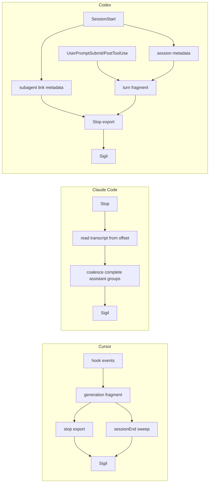
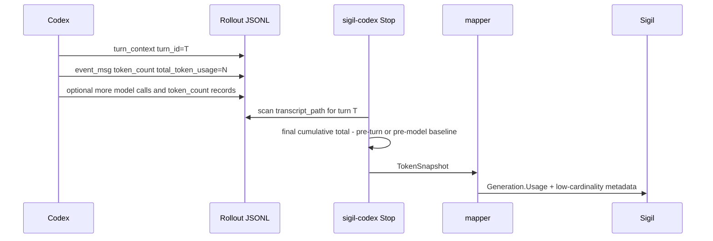
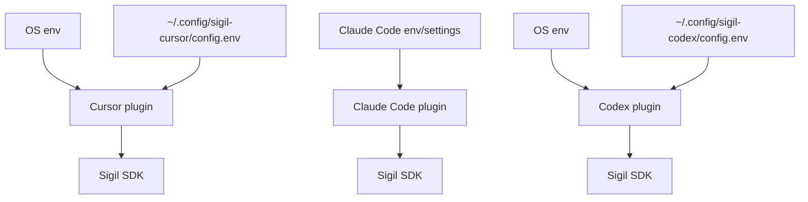
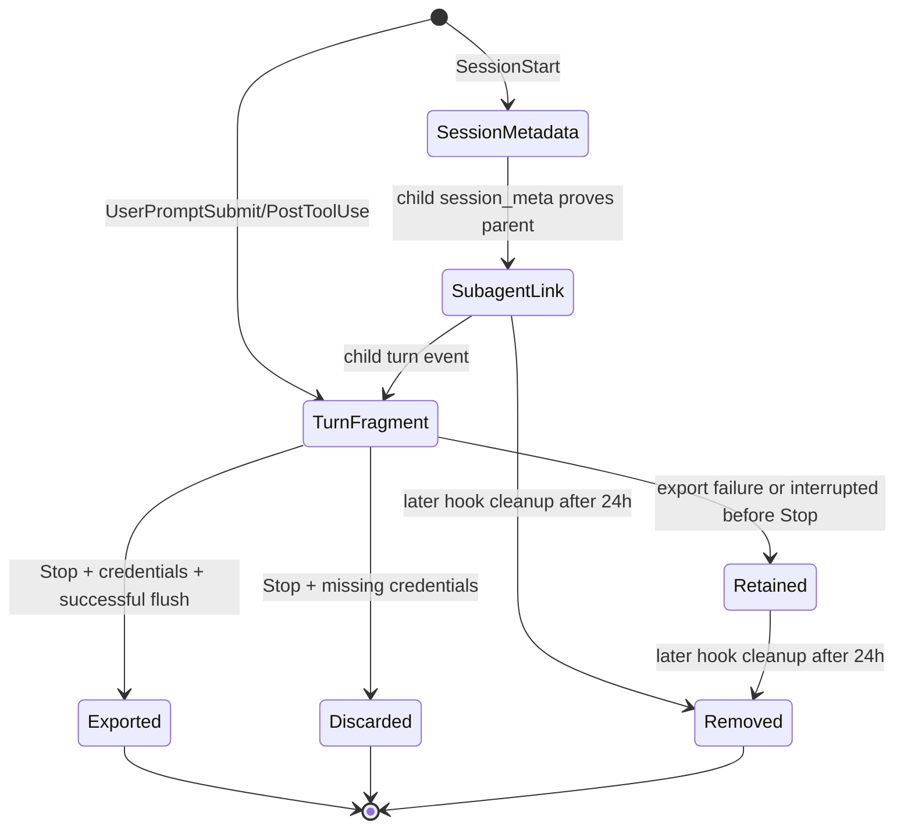
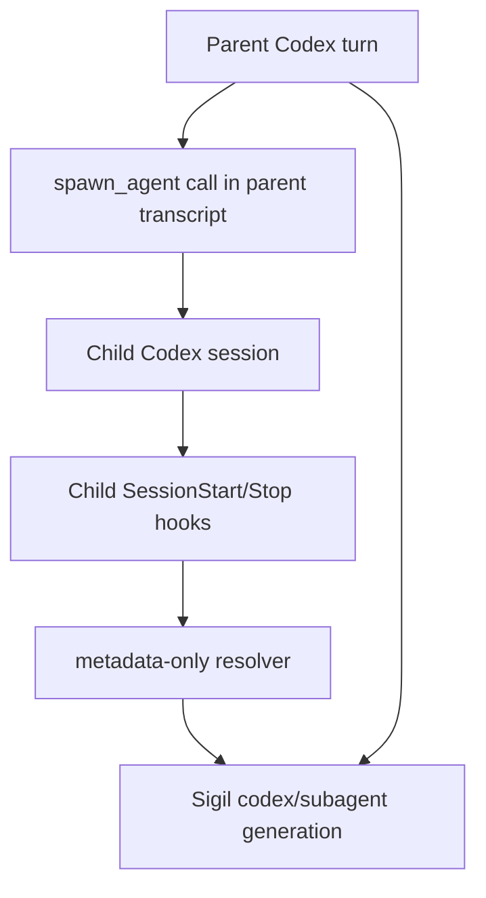

# Coding Agent Feature Comparison

This document compares the current Sigil plugins for Cursor, Claude Code (CC),
and Codex. It is written for reviewers who need the Codex behavior in context
without rereading three plugin implementations.

## Summary

| Area | Cursor | Claude Code | Codex |
| --- | --- | --- | --- |
| Runtime shape | Plugin hook config calls `sigil-cursor` through a wrapper script. | `.claude-plugin` registers command hooks for `sigil-cc`. | `.codex-plugin` points at a hook config that runs `sigil-codex`. |
| Telemetry assembly | Buffers hook events into fragments; `stop` exports; `sessionEnd` sweeps leftovers. | Reads new transcript JSONL lines at `Stop` and exports complete assistant groups. | Stores session metadata, per-turn fragments, and best-effort subagent link metadata; `Stop` exports completed turns; stale local JSON is cleaned after 24 hours. |
| Credential source | OS env plus `~/.config/sigil-cursor/config.env`; OS env wins. | Claude Code process/settings env. | OS env plus `~/.config/sigil-codex/config.env`; OS env wins and dotenv imports only `SIGIL_*` plus supported OTel keys. |
| First-install trust | Managed by Cursor's plugin runtime. | Managed by Claude Code's plugin runtime. | Codex `/hooks` should show `Plugin - sigil-codex@grafana-sigil`; first-run trust review is expected. |
| Setup contract | Install plugin, install binary, write `config.env`. | Install plugin/binary, provide canonical `SIGIL_*` env. | Install plugin, enable the hook/plugin hook flags exposed by `codex features list`, install binary on `PATH`, write `config.env`. |

Evidence:

- Cursor hook config: [`plugins/cursor/hooks/hooks.json`](plugins/cursor/hooks/hooks.json)
- Claude Code hook config: [`plugins/claude-code/.claude-plugin/plugin.json`](plugins/claude-code/.claude-plugin/plugin.json)
- Codex package and hooks: [`plugins/codex/.codex-plugin/plugin.json`](plugins/codex/.codex-plugin/plugin.json), [`plugins/codex/hooks/hooks.json`](plugins/codex/hooks/hooks.json)
- Codex hook runtime behavior and payload fields:
  [OpenAI Codex hooks docs](https://developers.openai.com/codex/hooks)

## Telemetry Flow

The key Codex limitation is lifecycle shape: completed turns export on `Stop`;
turns interrupted before `Stop` are not exported and can leave a local fragment
under the Sigil Codex state directory until stale cleanup removes it.

## Feature Matrix

| Feature | Cursor | Claude Code | Codex |
| --- | --- | --- | --- |
| Generation export | Yes, on `stop`; `sessionEnd` can retry/sweep stranded fragments. | Yes, from transcript groups found during `Stop`. | Yes, from the current turn fragment during `Stop`; no replay queue. |
| Session start capture | Yes, via `sessionStart`. | Yes, `SessionStart` stores model context. | Yes, session-scoped metadata is stored and inherited by later turn fragments. |
| User prompt capture | Yes, via `beforeSubmitPrompt`. | Yes, from transcript user records. | Yes, via `UserPromptSubmit`; text is persisted only outside `metadata_only`. |
| Assistant response capture | Yes, via response hooks and final stop metadata. | Yes, from transcript assistant records. | Yes, from `last_assistant_message` on `Stop`; text is persisted only outside `metadata_only`. |
| Tool capture | Yes, via `postToolUse` and `postToolUseFailure`. | Yes, from transcript tool calls/results. | Supported Codex hook tools only via `PostToolUse`; raw args/results persist only in `full`. |
| Tool execution spans | Yes. | Yes. | Yes, for supported Codex hook tools from fragment tool records. |
| Failed tool status | Yes, from failure hook. | Yes, when transcript tool result data marks an error. | Conservative: error only when Codex provides explicit status/error data or a known response shape proves failure; otherwise unknown. |
| Token usage | Yes, from Cursor payloads. | Yes, from transcript `usage` fields. | Yes, from rollout `event_msg/token_count` records. Usage is a per-turn cumulative `total_token_usage` delta; no monetary cost is calculated in the plugin. |
| Conversation id | Cursor `conversation_id`. | Claude Code `session_id`. | Codex `session_id`. |
| Generation id | Cursor `generation_id`. | Derived from transcript context. | Deterministic hash of `session_id + turn_id`. |
| Subagent linkage | Background-agent work is tagged when available; no parent edge. | Synthesizes `agent_name=claude-code/subagent` generations from `Agent` tool calls with `ParentGenerationIDs`. | Best-effort `agent_name=codex/subagent`: resolved child turns use parent conversation id and `ParentGenerationIDs`; partial child links stay in the child conversation. |
| Interrupted turns | `sessionEnd` emits or cleans stranded fragments. | Incomplete transcript groups are skipped until complete. | Not exported without `Stop`; stale local fragments are best-effort cleaned after 24 hours. |
| Guard/pre-tool policy | Not implemented in Cursor plugin. | Implemented through `PreToolUse`. | Deferred; Codex registers telemetry hooks only. |

Evidence:

- Cursor stop/session-end handling: [`plugins/cursor/internal/hook/stop.go`](plugins/cursor/internal/hook/stop.go), [`plugins/cursor/internal/hook/sessionend.go`](plugins/cursor/internal/hook/sessionend.go)
- Claude Code transcript export: [`plugins/claude-code/cmd/sigil-cc/main.go`](plugins/claude-code/cmd/sigil-cc/main.go), [`plugins/claude-code/internal/transcript/transcript.go`](plugins/claude-code/internal/transcript/transcript.go)
- Codex handlers, fragments, rollout parser, token usage mapper, and subagent mapping: [`plugins/codex/internal/hook/handlers.go`](plugins/codex/internal/hook/handlers.go), [`plugins/codex/internal/fragment/fragment.go`](plugins/codex/internal/fragment/fragment.go), [`plugins/codex/internal/codexlog/codexlog.go`](plugins/codex/internal/codexlog/codexlog.go), [`plugins/codex/internal/mapper/mapper.go`](plugins/codex/internal/mapper/mapper.go)

## Codex Token Usage Flow

Codex differs from Claude Code here: Claude Code usage is embedded in assistant
transcript messages, while Codex usage is stored as separate rollout
`event_msg/token_count` records. The Codex plugin therefore reads the rollout at
`Stop`, tracks the active `turn_context.turn_id`, and maps only an attributable
cumulative delta to `Generation.Usage`
[`plugins/codex/internal/codexlog/codexlog.go`](plugins/codex/internal/codexlog/codexlog.go),
[`plugins/codex/internal/hook/handlers.go`](plugins/codex/internal/hook/handlers.go),
[`plugins/codex/internal/mapper/mapper.go`](plugins/codex/internal/mapper/mapper.go).
Pre-model `token_count` records inside the target turn are treated as baseline
snapshots for resumed rollouts rather than as current-turn usage.
Raw cumulative token values and context window are metadata, not tags, and
pricing remains outside the plugin.

## Content And Privacy

| Feature | Cursor | Claude Code | Codex |
| --- | --- | --- | --- |
| Capture modes | `metadata_only`, `full`, `no_tool_content`. | `metadata_only`, `full`, `no_tool_content`. | `metadata_only`, `full`, `no_tool_content`. |
| Default content posture | Metadata only. | Metadata only. | Metadata only. |
| User/assistant text in `metadata_only` | Stripped. | Stripped. | Not persisted or exported. |
| Tool args/results in `metadata_only` | Raw content stripped. | Raw content stripped. | Tool names/status only; raw content is dropped before fragment persistence. |
| Tool args/results in `no_tool_content` | Raw content stripped or kept structural. | Excluded from spans. | Tool names/status only; user/assistant text may be included. |
| Tool args/results in `full` | Included according to capture rules. | Included with redaction. | Included with local redaction before export. |
| Hidden reasoning/thinking | Not exported as raw content. | Not exported as raw content. | Not exported as raw content. |

Evidence:

- Content mode resolution: [`plugins/codex/internal/config/config.go`](plugins/codex/internal/config/config.go)
- Raw persistence decisions and span export redaction: [`plugins/codex/internal/hook/handlers.go`](plugins/codex/internal/hook/handlers.go)
- Generation message redaction: [`plugins/codex/internal/mapper/mapper.go`](plugins/codex/internal/mapper/mapper.go)

Codex full-mode JSON redaction decodes and re-marshals JSON rather than
rewriting serialized JSON text, so redacted tool inputs/results remain valid
JSON. It also redacts values under sensitive keys such as `password`, `token`,
`api_key`, `client_secret`, and `authorization`. Invalid raw JSON falls back to
a redacted JSON string
[`plugins/codex/internal/redact/json.go`](plugins/codex/internal/redact/json.go),
[`plugins/codex/internal/mapper/mapper.go`](plugins/codex/internal/mapper/mapper.go).

For Codex, `full` and `no_tool_content` can store allowed prompt and assistant
text raw in local fragment files until export or stale cleanup. Redaction is the
export boundary, not the local persistence boundary.

## Config Ownership

Codex follows Cursor's Sigil-owned dotenv pattern because hook subprocesses are
not a reliable place to depend on shell profile exports. Codex CLI config only
enables Codex features and the plugin; Sigil credentials belong in `config.env`.
The Codex dotenv loader rejects relative `XDG_CONFIG_HOME` values and ignores
unrelated dotenv keys such as `PATH`, so `config.env` does not become a general
process-environment overlay. Sigil-prefixed OTel endpoint/auth settings are
passed directly to the OTel exporters with `/v1/traces` and `/v1/metrics`
derived from the configured base endpoint, so inherited signal-specific OTel
vars do not override the Sigil destination.

## Codex Local State

Codex does not expose a session-end sweeper hook with Cursor's lifecycle
semantics. The plugin therefore deletes successful turn fragments immediately,
discards fragments when required auth is absent, and removes retained fragments
after 24 hours on later hook invocations. Subagent link files use the same stale
cleanup policy, but successful exports keep the link so later child-session
turns can still attach to the original parent. Session and turn ids are
sanitized and hashed before becoming filenames to avoid collisions between ids
that normalize to the same readable prefix.

## Codex Subagent Shape

Codex hook payloads do not yet provide authoritative subagent lineage fields, so
the plugin reads only local transcript metadata: child `session_meta`, parent
`turn_context`, and parent `spawn_agent` call/output records. If that evidence
is complete, the child generation gets `ParentGenerationIDs` and uses the parent
session id as `conversation_id`. If only the child `session_meta` proves the
session is a subagent, the generation is still labeled `codex/subagent` but
stays in the child conversation with `codex.link_source=partial`. The upstream
hook parity tracker lists subagent lifecycle and full tool-hook coverage as
unfinished Codex hook work [openai/codex#21753](https://github.com/openai/codex/issues/21753).

## Operational Notes For Reviewers

- Codex hook commands must stay quiet on stdout; debug logs go to a state-file
  logger only when `SIGIL_DEBUG=true`.
- Fragment updates use per-file lock files because Codex can launch matching
  command hooks concurrently
  [OpenAI Codex hooks docs](https://developers.openai.com/codex/hooks).
- Missing Sigil credentials are setup absence: the current fragment is discarded
  at `Stop`, and the Codex turn continues.
- Sigil generation enqueue/client flush failures retain the fragment only until
  stale cleanup; there is no retry queue. OTel flush failures are logged after
  the generation export path and do not preserve the fragment.
- Codex subagent linkage is best-effort and metadata-only. It must not block a
  normal generation export when transcripts are missing, malformed, oversized,
  or no longer match the expected shape.
- Do not combine the Codex plugin with another `Stop` hook that continues the
  same turn. Codex launches matching Stop hooks concurrently, so this plugin may
  export the pre-continuation Stop boundary before the other hook asks Codex to
  keep going.
- OTel uses `SIGIL_OTEL_EXPORTER_OTLP_*` first and falls back to plain
  `OTEL_EXPORTER_OTLP_*`. Generation export works without OTel, but the full AI
  Observability UI needs it.
- The Codex plugin package is exposed through the repo-local marketplace entry
  at [`.agents/plugins/marketplace.json`](.agents/plugins/marketplace.json).
