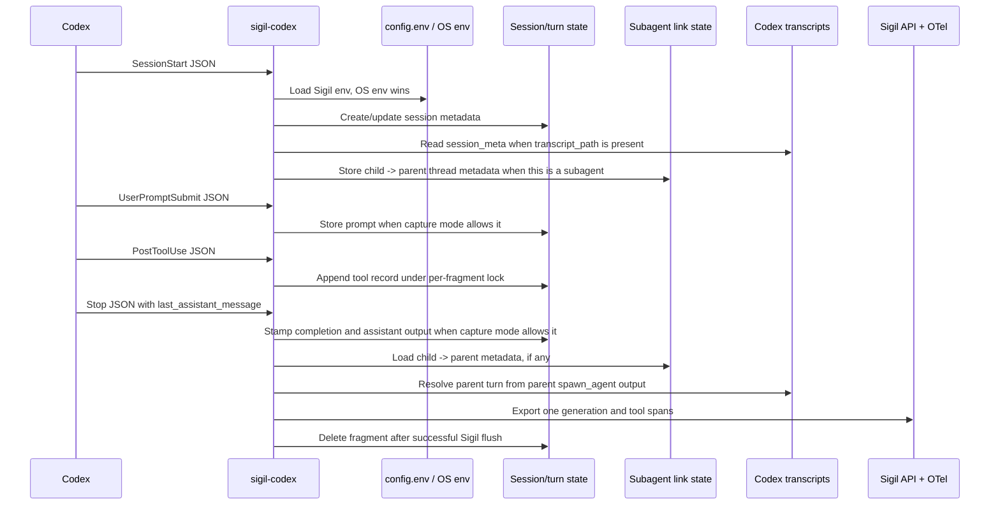
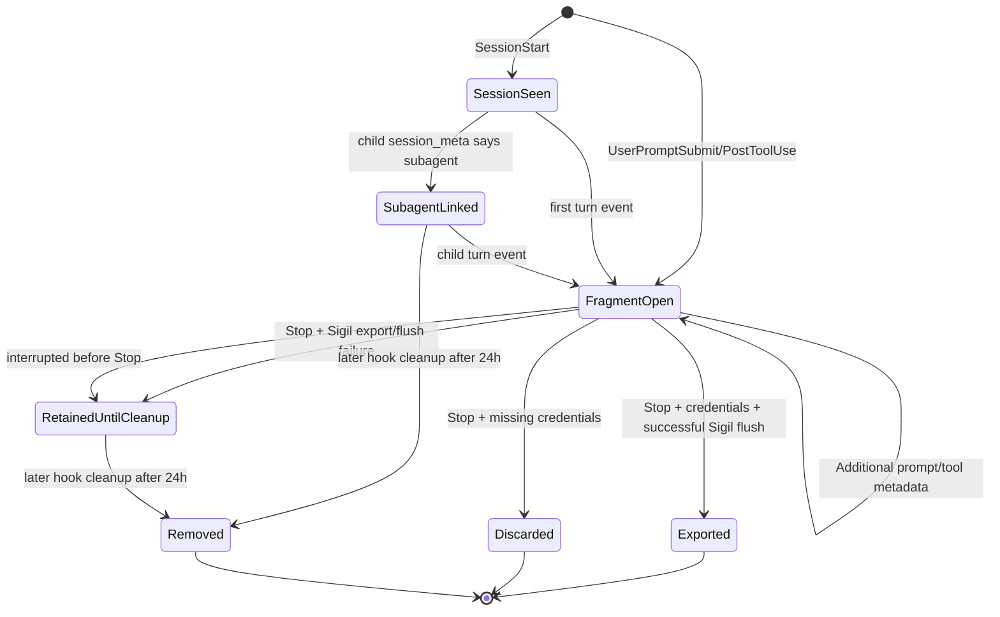

# Codex Plugin Reviewer Guide

This file is a reviewer guide for the implemented Codex Sigil plugin. It
replaces the earlier build plan with a code-oriented explanation of what ships,
how the pieces fit together, and what reviewers should verify.

## What Ships

The Codex plugin lives under [`plugins/codex`](plugins/codex). It adds a Go hook
binary named `sigil-codex`, a Codex plugin manifest, hook registrations, local
turn-fragment persistence, best-effort subagent linkage, generation mapping,
OTel setup, tests, and end-user installation docs.

| Piece | Purpose | Code |
| --- | --- | --- |
| Plugin manifest | Defines the Codex plugin package and points Codex at the hook config. | [`plugins/codex/.codex-plugin/plugin.json`](plugins/codex/.codex-plugin/plugin.json) |
| Hook config | Registers `SessionStart`, `UserPromptSubmit`, `PostToolUse`, and `Stop` command hooks. | [`plugins/codex/hooks/hooks.json`](plugins/codex/hooks/hooks.json) |
| Dispatcher | Loads Sigil dotenv config, parses one hook payload from stdin, routes by event, and suppresses accidental stdout. | [`plugins/codex/cmd/sigil-codex/main.go`](plugins/codex/cmd/sigil-codex/main.go) |
| Config loader | Reads `${XDG_CONFIG_HOME:-$HOME/.config}/sigil-codex/config.env`; process env wins per key. | [`plugins/codex/internal/config/config.go`](plugins/codex/internal/config/config.go) |
| Fragment store | Persists session metadata and one lightweight JSON fragment per `session_id + turn_id`, guarded by per-file lock files. | [`plugins/codex/internal/fragment/fragment.go`](plugins/codex/internal/fragment/fragment.go) |
| State paths | Stores fragments and debug logs under `$XDG_STATE_HOME/sigil-codex` or `~/.local/state/sigil-codex`; state filenames use sanitized prefixes plus hashes. | [`plugins/codex/internal/fragment/paths.go`](plugins/codex/internal/fragment/paths.go) |
| Codex transcript parser | Reads only metadata records needed to identify child sessions and parent `spawn_agent` calls. | [`plugins/codex/internal/codexlog/codexlog.go`](plugins/codex/internal/codexlog/codexlog.go) |
| Hook handlers | Updates fragments and emits on `Stop`. | [`plugins/codex/internal/hook/handlers.go`](plugins/codex/internal/hook/handlers.go) |
| Mapper | Converts fragments into Sigil generation records, tool definitions, messages, and tags. | [`plugins/codex/internal/mapper/mapper.go`](plugins/codex/internal/mapper/mapper.go) |
| OTel setup | Configures OTLP trace/metric exporters from Sigil-prefixed env vars. | [`plugins/codex/internal/otel/otel.go`](plugins/codex/internal/otel/otel.go) |
| User guide | Documents install, auth, content capture, verification, and troubleshooting. | [`plugins/codex/README.md`](plugins/codex/README.md) |

The repo-local Codex marketplace entry exposes the plugin as
`sigil-codex@grafana-sigil` through
[`.agents/plugins/marketplace.json`](.agents/plugins/marketplace.json).
Codex plugin manifests can bundle lifecycle hook config through a `hooks` entry
or a default `./hooks/hooks.json` file, which is the packaging shape used here
[OpenAI Codex plugin docs](https://developers.openai.com/codex/plugins/build#bundled-mcp-servers-and-lifecycle-config).

## Runtime Flow



Each hook invocation is a separate process. The fragment file is the correlation
point between early hook events and the final `Stop` event. Current Codex docs
state that multiple matching command hooks for the same event can run
concurrently, so fragment updates are serialized with per-file lock files rather
than relying on process ordering
[`fragment.go`](plugins/codex/internal/fragment/fragment.go),
[OpenAI Codex hooks docs](https://developers.openai.com/codex/hooks).
The dispatcher calls `config.ApplyEnv` before logger or SDK setup so
dotenv-provided Sigil and supported OTel values are visible to the plugin and
the SDK from process start
[`main.go`](plugins/codex/cmd/sigil-codex/main.go),
[`config.go`](plugins/codex/internal/config/config.go).

## Fragment And Link Lifecycle



The Codex hook surface does not currently provide a session-end event equivalent
to Cursor's `sessionEnd`. A completed turn exports on `Stop`. If a user exits or
interrupts while the agent is still thinking, Codex may not send `Stop`, and the
incomplete turn is not exported by this implementation. Incomplete fragments can
remain under `${XDG_STATE_HOME:-$HOME/.local/state}/sigil-codex/turns`; in
`full` or `no_tool_content` mode they can contain locally retained content
allowed by that mode. Session metadata is stored separately under `sessions/`.
Subagent link metadata is stored under `subagents/`; it contains only thread
ids, parent turn ids, spawn call ids, role/nickname/depth metadata, and resolver
timestamps. The plugin does not implement replay or retry for retained
fragments. Later hook invocations perform best-effort cleanup of session, turn,
and subagent-link JSON files older than 24 hours
[`fragment.go`](plugins/codex/internal/fragment/fragment.go).

## Hook Events

| Event | Current behavior | Reviewer checks |
| --- | --- | --- |
| `SessionStart` | Requires `session_id`; stores session-scoped source, cwd, model, transcript path, and timestamps. If `transcript_path` points at a child subagent transcript, stores best-effort child -> parent link metadata. If a `turn_id` is present, the current turn fragment is updated too. | It should not require credentials; session metadata should seed later turn fragments; malformed or missing transcript metadata should fail open [`handlers.go`](plugins/codex/internal/hook/handlers.go), [`codexlog.go`](plugins/codex/internal/codexlog/codexlog.go). |
| `UserPromptSubmit` | Stores prompt only when capture mode is not `metadata_only`. | `metadata_only` should not persist prompt text. Other modes may persist allowed prompt text locally, then redact before export [`handlers.go`](plugins/codex/internal/hook/handlers.go). |
| `PostToolUse` | Appends tool name/id and conservative status for hook-visible Codex tools. Raw tool input/output is kept only in `full` mode. | Tool content should be dropped before disk persistence in `metadata_only` and `no_tool_content`. Status should remain unknown unless Codex provides explicit status/error data or a known response shape proves success/failure. Codex docs note that `PostToolUse` does not cover every shell path, WebSearch, or other non-shell, non-MCP tools [`handlers.go`](plugins/codex/internal/hook/handlers.go), [OpenAI Codex hooks docs](https://developers.openai.com/codex/hooks). |
| `Stop` | Stamps completion, records `stop_hook_active`, stores assistant text when allowed, resolves any subagent parent turn from the parent transcript, builds Sigil client, maps one generation, emits tool spans, flushes, and deletes the fragment. | Missing credentials discard; Sigil export/flush failures retain only until stale cleanup; subagent resolution must never block export; successful Sigil flush deletes the turn fragment but keeps link metadata for future child resumes [`handlers.go`](plugins/codex/internal/hook/handlers.go). |

Unknown events are logged in debug mode and ignored by the dispatcher
[`main.go`](plugins/codex/cmd/sigil-codex/main.go). The hook binary is
best effort: failures are logged but do not break the Codex turn, and panic
recovery logs then exits normally [`main.go`](plugins/codex/cmd/sigil-codex/main.go).

## Configuration And Auth

Codex feature flags and plugin enablement live in `~/.codex/config.toml`; Sigil
credentials do not. Current public Codex docs name the hook feature
`codex_hooks`, while some local builds expose split `hooks` and `plugin_hooks`
flags. Users should run `codex features list` and enable the hook/plugin hook
flags their build reports
[OpenAI Codex hooks docs](https://developers.openai.com/codex/hooks).

Current public docs show:

```toml
[features]
codex_hooks = true
```

Some builds use:

```toml
[features]
hooks = true
plugin_hooks = true

[plugins."sigil-codex@grafana-sigil"]
enabled = true
```

Sigil auth and export settings live in OS env or
`${XDG_CONFIG_HOME:-$HOME/.config}/sigil-codex/config.env`. The dotenv loader
fills only unset keys, so process env wins per key
[`config.go`](plugins/codex/internal/config/config.go).
Relative `XDG_CONFIG_HOME` and `XDG_STATE_HOME` values are ignored so hook state
does not silently move under the session cwd
[`config.go`](plugins/codex/internal/config/config.go),
[`paths.go`](plugins/codex/internal/fragment/paths.go).
Session and turn ids are sanitized and hashed before becoming filenames so ids
that normalize to the same readable prefix still get distinct state paths
[`paths.go`](plugins/codex/internal/fragment/paths.go).
The dotenv loader imports only `SIGIL_*` variables plus supported OTel variables
such as `OTEL_EXPORTER_OTLP_ENDPOINT`, `OTEL_EXPORTER_OTLP_HEADERS`,
`OTEL_EXPORTER_OTLP_INSECURE`, and `OTEL_SERVICE_NAME`
[`config.go`](plugins/codex/internal/config/config.go).
Sigil-prefixed OTel endpoint/auth settings are passed directly to the OTel HTTP
exporters. The configured base endpoint is normalized to `/v1/traces` and
`/v1/metrics`, and inherited signal-specific OTel variables such as
`OTEL_EXPORTER_OTLP_TRACES_ENDPOINT` do not override the Sigil destination
[`otel.go`](plugins/codex/internal/otel/otel.go).

| Variable | Required | Behavior |
| --- | --- | --- |
| `SIGIL_ENDPOINT` | yes | Base Sigil API URL; the exporter appends `/api/v1/generations:export` [`handlers.go`](plugins/codex/internal/hook/handlers.go). |
| `SIGIL_AUTH_TENANT_ID` | yes | Grafana Cloud stack/instance ID; used as Basic auth username and tenant id. |
| `SIGIL_AUTH_TOKEN` | yes | Grafana Cloud token with `sigil:write`; also used as the OTel password when `SIGIL_OTEL_AUTH_TOKEN` is absent. |
| `SIGIL_OTEL_EXPORTER_OTLP_ENDPOINT` | for full UI | Enables OTel traces and metrics; generation export works without it. Falls back to `OTEL_EXPORTER_OTLP_ENDPOINT` [`otel.go`](plugins/codex/internal/otel/otel.go). |
| `SIGIL_OTEL_AUTH_TOKEN` | no | Overrides `SIGIL_AUTH_TOKEN` for OTel Basic auth [`otel.go`](plugins/codex/internal/otel/otel.go). |
| `SIGIL_CONTENT_CAPTURE_MODE` | no | `metadata_only`, `full`, or `no_tool_content`; unknown values fail closed to `metadata_only` [`config.go`](plugins/codex/internal/config/config.go). |
| `SIGIL_DEBUG` | no | Enables debug file logging under the Sigil Codex state directory [`main.go`](plugins/codex/cmd/sigil-codex/main.go). |

Missing `SIGIL_ENDPOINT`, `SIGIL_AUTH_TENANT_ID`, or `SIGIL_AUTH_TOKEN` is
treated as setup absence. The `Stop` handler logs in debug mode, deletes the
current fragment, and returns without exporting
[`handlers.go`](plugins/codex/internal/hook/handlers.go).

## Content Capture And Redaction

| Mode | User prompt | Assistant text | Tool calls | Tool args/results |
| --- | --- | --- | --- | --- |
| `metadata_only` | Not persisted or exported. | Not persisted or exported. | Tool names/ids/status are exported. | Raw content dropped before fragment persistence. |
| `no_tool_content` | Persisted locally, then redacted before export. | Persisted locally, then redacted before export. | Tool names/ids/status are exported. | Raw content dropped before fragment persistence. |
| `full` | Persisted locally, then redacted before export. | Persisted locally, then redacted before export. | Tool names/ids/status are exported. | Raw content persisted locally, then redacted before export. |

The privacy boundary is split deliberately:

- Handlers decide what raw content is allowed to hit disk
  [`handlers.go`](plugins/codex/internal/hook/handlers.go).
- The mapper redacts text and JSON before building Sigil messages
  [`mapper.go`](plugins/codex/internal/mapper/mapper.go).
- Hidden reasoning content is not mapped.

Full-mode JSON redaction decodes JSON, redacts known secret patterns, redacts
values under sensitive keys such as `password`, `token`, `api_key`,
`client_secret`, and `authorization`, then marshals it again. Invalid JSON falls
back to a redacted JSON string, so exported tool JSON remains valid
[`redact/json.go`](plugins/codex/internal/redact/json.go),
[`mapper.go`](plugins/codex/internal/mapper/mapper.go).

## Mapping And Export

The mapper creates one sync generation for each completed turn. For ordinary
Codex turns it uses:

- `AgentName=codex`
- `ConversationID=session_id`
- deterministic generation id from `session_id + turn_id`
- model provider inferred from the model slug, with fallback provider `codex`
- built-in tags `entrypoint=codex`, `cwd`, and `hook.source`
- `codex.stop_hook_active=true|false` from the Stop payload
- tool definitions deduplicated by tool name

These fields are built in
[`mapper.go`](plugins/codex/internal/mapper/mapper.go), with the
deterministic id in
[`mapper.go`](plugins/codex/internal/mapper/mapper.go).

For a resolved subagent turn, the mapper changes only the relationship fields:

- `AgentName=codex/subagent`
- `ConversationID=<parent-session-id>`
- `ParentGenerationIDs=[<parent-generation-id>]`
- tags include `subagent=true`, `codex.thread_source=subagent`,
  `codex.link_source=transcript`, and `codex.agent_role=<role>` when known
- metadata carries the original child session id, parent session id, parent
  turn id, spawn call id, nickname, depth, and link source

If the plugin can prove that a child session is a subagent but cannot resolve
the parent turn, it still exports with `AgentName=codex/subagent`,
`ConversationID=<child-session-id>`, and `codex.link_source=partial`. That keeps
the generation visible without inventing an unsupported parent edge
[`mapper.go`](plugins/codex/internal/mapper/mapper.go).

Subagent linkage is intentionally best-effort. Codex hook payloads do not yet
provide stable `parent_session_id`, `agent_id`, or `SubagentStart`/`SubagentStop`
fields; the open hook parity tracker calls out subagent lineage and complete
tool hook coverage as unfinished areas
[openai/codex#21753](https://github.com/openai/codex/issues/21753). The plugin
therefore reads only local transcript metadata: child `session_meta`, parent
`turn_context`, and parent `spawn_agent` call/output records
[`codexlog.go`](plugins/codex/internal/codexlog/codexlog.go).

The Codex plugin exports token usage when the Codex rollout can be attributed to
the completed turn. Hook stdin does not carry token counts directly, so the
Stop handler reads the rollout path from `transcript_path`, tracks
`turn_context.turn_id`, and computes per-generation usage from the completed
turn's cumulative `total_token_usage` delta
[`codexlog.go`](../../internal/codexlog/codexlog.go),
[`handlers.go`](../../internal/hook/handlers.go). The mapper sets
`Generation.Usage` for input, output, total, cache-read, and reasoning tokens,
and stores final cumulative totals plus context window in metadata rather than
tags [`mapper.go`](../../internal/mapper/mapper.go).
When Codex emits a `token_count` after `turn_context` but before assistant
model activity, the parser treats that snapshot as a resumed-thread baseline
instead of charging it to the new turn.

The plugin does not calculate monetary cost. Sigil or Grafana dashboards should
derive cost downstream from provider, model, and token counts when pricing
metadata is available.

Current Codex `PostToolUse` input documents `tool_response`, but not generic
status, duration, or timestamp fields
[OpenAI Codex hooks docs](https://developers.openai.com/codex/hooks). The
plugin accepts extra fields for compatibility, but it treats tool status as
unknown unless an explicit status/error field or a recognized response shape
proves success or failure [`handlers.go`](plugins/codex/internal/hook/handlers.go).

On `Stop`, the handler starts a Sigil generation, sets the mapped result, emits
tool spans, flushes the Sigil client, force-flushes OTel providers when present,
and deletes the fragment only after successful Sigil enqueue and client flush.
OTel force-flush errors are logged but do not preserve the fragment
[`handlers.go`](plugins/codex/internal/hook/handlers.go).
The Stop path uses a timeout below the 30-second Codex hook timeout and a
reduced generation-export retry budget so export failures return control to
Codex promptly.

This plugin should not be combined with another `Stop` hook that continues the
same Codex turn with `decision: "block"` or `continue: false` behavior. Codex
launches matching command hooks concurrently, so `sigil-codex` cannot know that
another Stop hook will ask Codex to keep going. In that setup, Sigil may receive
a partial generation for the pre-continuation Stop boundary and another
generation later. The `codex.stop_hook_active` tag records the payload flag for
review, but it is not a merge/delay mechanism
[OpenAI Codex hooks docs](https://developers.openai.com/codex/hooks).

## Verification

Reviewers can validate the implementation without a repo-root e2e script:

```bash
cd plugins/codex
go test ./...
go install ./cmd/sigil-codex
command -v sigil-codex
```

For an actual Codex-to-Sigil smoke test:

1. Run `codex features list`, then enable the hook/plugin hook flags exposed by
   your Codex build in `~/.codex/config.toml`.
2. Enable `plugins."sigil-codex@grafana-sigil"`.
3. Put Sigil values in `${XDG_CONFIG_HOME:-$HOME/.config}/sigil-codex/config.env`.
4. Start a fresh `codex` session.
5. Open `/hooks` and confirm the source is `Plugin - sigil-codex@grafana-sigil`.
6. Trust the four plugin hooks on first use.
7. Run one harmless prompt that uses a shell command and let the agent finish.
8. Check Grafana AI Observability for a new `agent_name=codex` conversation.
9. If `SIGIL_DEBUG=true`, confirm the local log contains `UserPromptSubmit`,
   `PostToolUse`, `Stop`, and `stop: emitted session=...`.

The turn must finish normally. Exiting after a completed turn is fine; exiting
while the agent is still thinking can skip `Stop`, so the incomplete turn will
not be exported.

For subagent smoke coverage, run a prompt that asks Codex to spawn and wait for
a small subagent. The expected Sigil result is a parent `agent_name=codex`
generation plus a child `agent_name=codex/subagent` generation. When the parent
spawn output is present in the transcript, the child uses the parent session as
its conversation id and includes `parent_generation_ids`.

## Known Non-Goals In This Change

- No Codex `PreToolUse` or `PermissionRequest` guard integration. The first
  Codex implementation is telemetry-only.
- No broad transcript replay or stale-fragment retry subsystem. Hook payloads
  plus `Stop` are the source of truth for now, and stale local JSON is cleaned
  after 24 hours.
- No session-end sweeper for interrupted Codex turns, because Codex does not
  currently expose a plugin hook with that lifecycle meaning.
- No authoritative subagent lifecycle contract. The implementation links
  subagents only when local transcript metadata proves the relationship.
- No monetary cost calculation. The plugin exports token counts only; pricing is
  downstream enrichment.
- No manual `~/.codex/hooks.json` setup path in user docs. The expected source
  is the installed plugin.

## Review Checklist

- Plugin packaging: manifest, marketplace entry, hook config, and binary command
  name line up.
- Runtime safety: no accidental stdout, hook errors do not fail Codex, and
  missing credentials do not block the user.
- Privacy: `metadata_only` never persists prompt/assistant/tool content, and
  `full` mode redacts before export while preserving valid JSON.
- Export correctness: completed turns map to one deterministic generation and
  tool spans use the same conversation/model context.
- Subagent correctness: child sessions link to a parent generation only when
  transcript metadata proves the parent turn; partial links remain visible
  without fake `ParentGenerationIDs`.
- Concurrency: concurrent hook processes cannot lose tool records through
  read-modify-write races in the fragment or subagent-link stores.
- Operational docs: end users are told to use `config.env` for Sigil auth,
  `~/.codex/config.toml` only for Codex flags/plugin enablement, and `/hooks`
  only for trust review.
